# **Import-Export Management System**

---

## **Project Overview**

The **Import-Export Management System** is a full-stack Java-based web application designed to streamline the operations between **sellers** and **consumers** in a trade ecosystem.

It automates the process of **product management, order placement, order tracking, issue reporting, and sales analytics**.
By using this portal, consumers can browse and order products, track their shipment status, report product issues, and manage their profile.
Sellers can add new products, update product details, manage received orders, handle consumer reports, and analyze their sales performance.

This system ensures **secure authentication**, **real-time updates**, and **role-based access control** using Java Servlets, JSP, and MySQL — following the **MVC architecture** for clean separation of logic, presentation, and data handling.

---
## 🎥 Demo Video

▶️ Watch the complete walkthrough of the Import-Export Management System covering:

- Consumer & Seller authentication
- Product management and order workflow
- Cart, order placement & tracking
- Sales analytics dashboard
- Complaint/issue reporting system
- Profile and dashboard management

[▶ Watch Project Demo](https://youtu.be/Xiwr_zZfXvo)

---

## 📸 Screenshots

### Login Page

Secure role-based authentication for consumers and sellers.

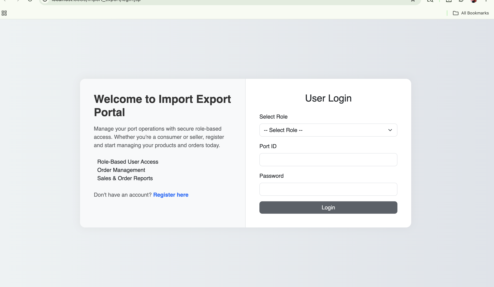

## Consumer

### Consumer Dashboard
Consumers can browse products, place orders, track shipments, and manage their profile.

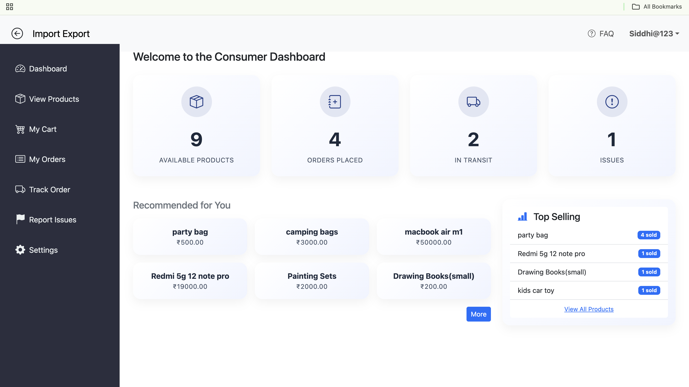

### View Products
Consumers can explore available products with detailed information and pricing.

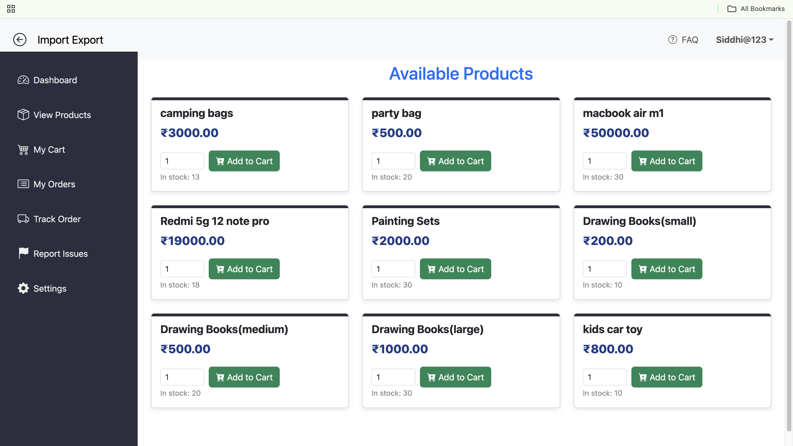

### Cart Management
Consumers can add products to cart and manage order quantities before checkout.

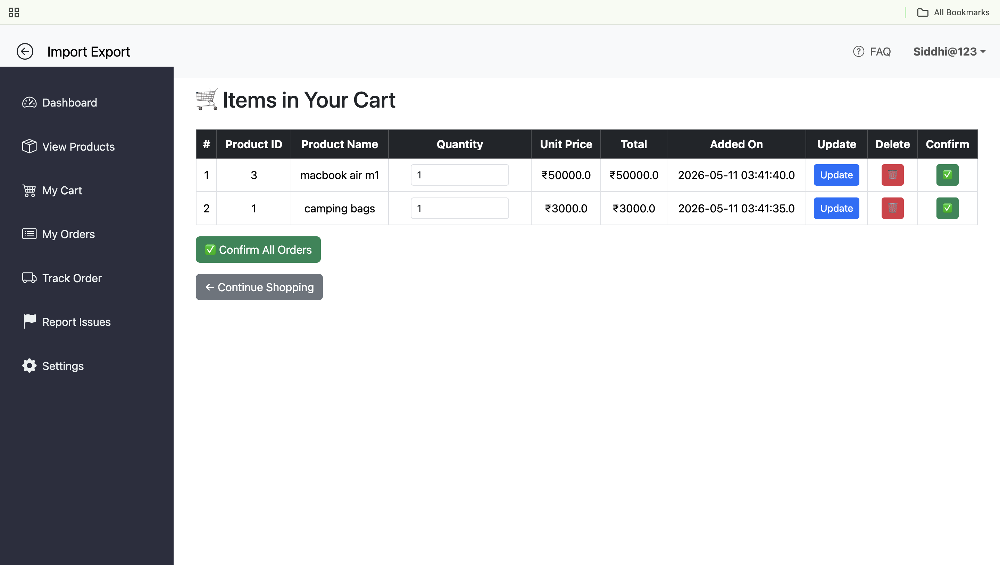

### My Orders
Consumers can view all placed orders along with their current status.

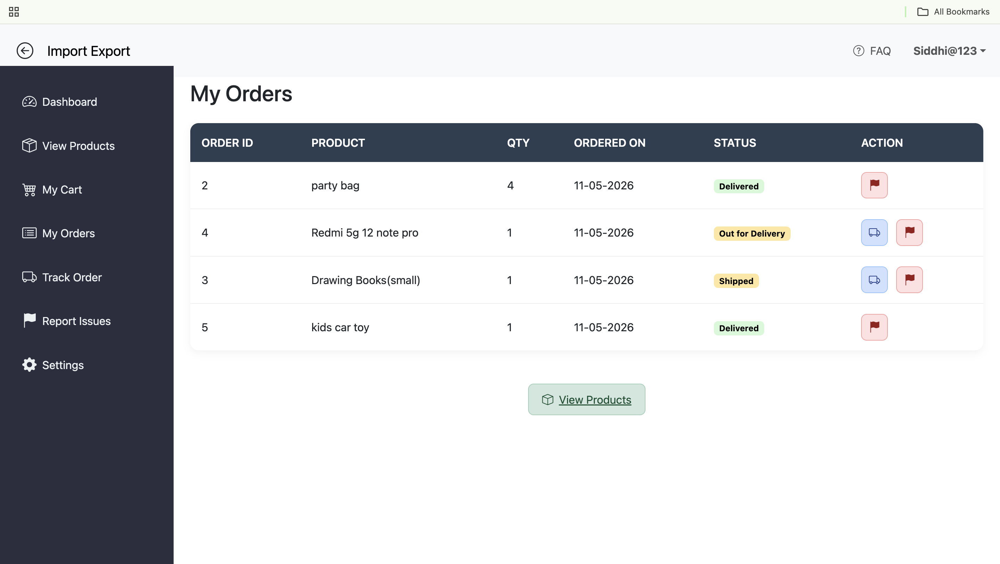

### Order Tracking
Track order progress in real time from placement to delivery.

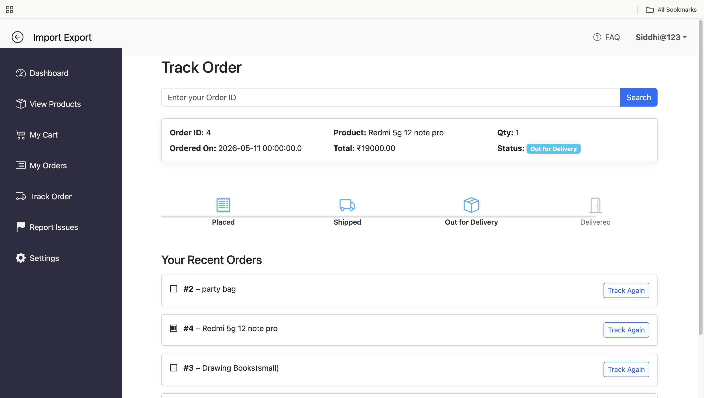

### Report Issues
Consumers can report defective or delayed products directly through the portal.

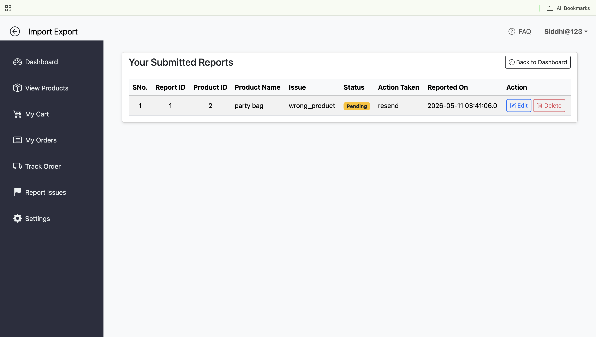

### Help & Support
Provides guidance and support information for consumers using the platform.

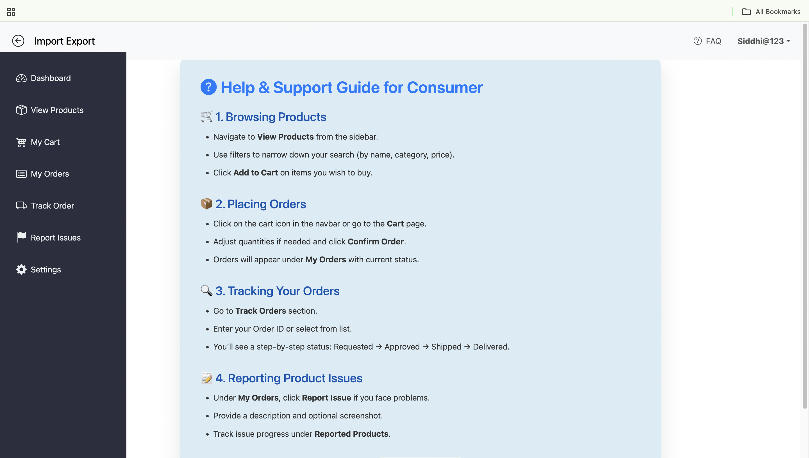

## Seller

### Seller Dashboard

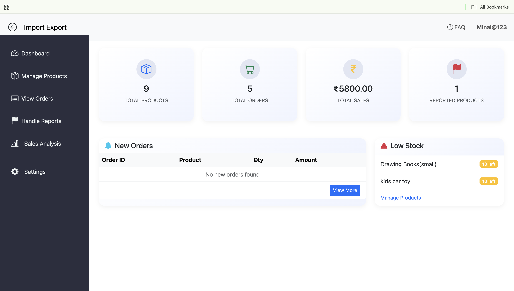

### Product Management

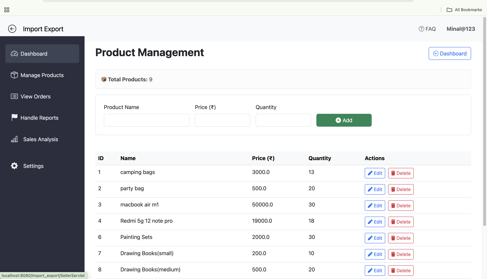

### Order Details

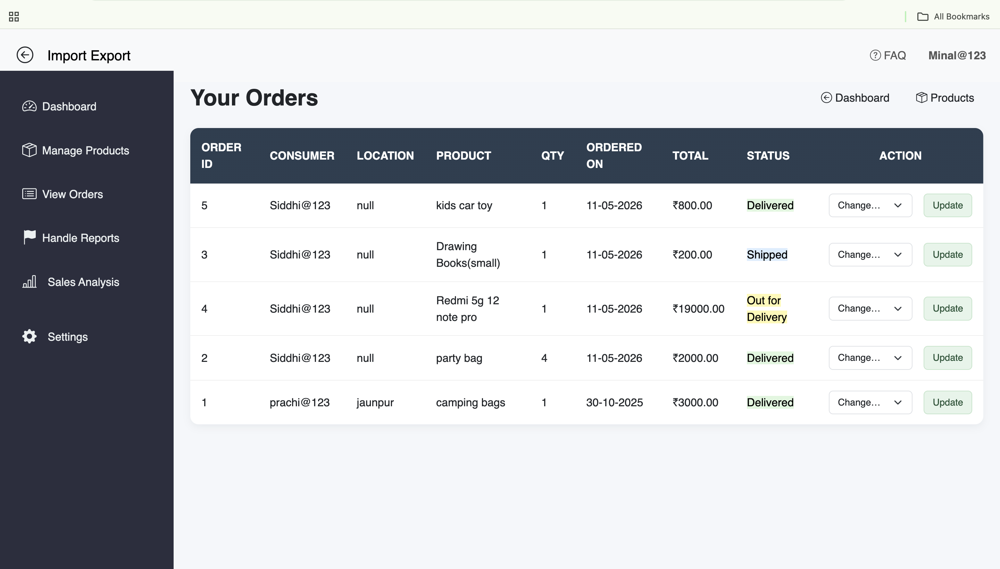

### Sales Analytics

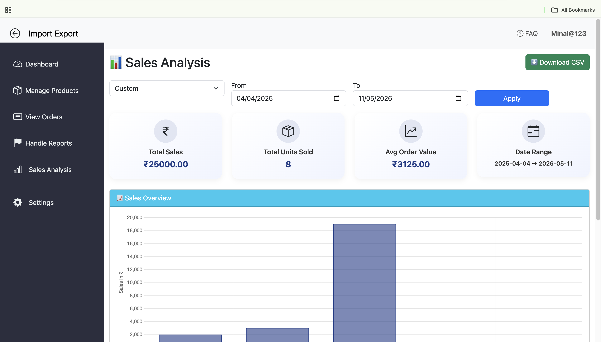

### Sales Visualization


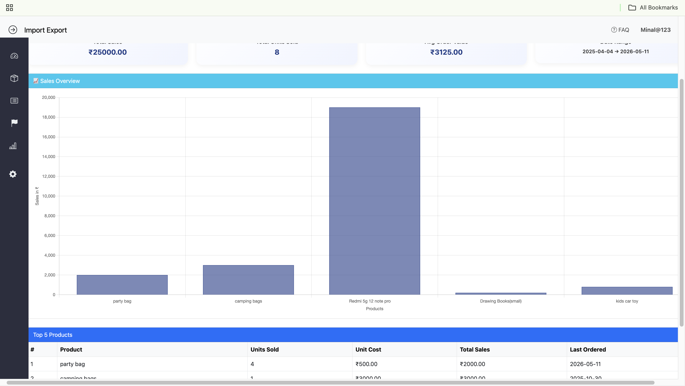

### Report Handling

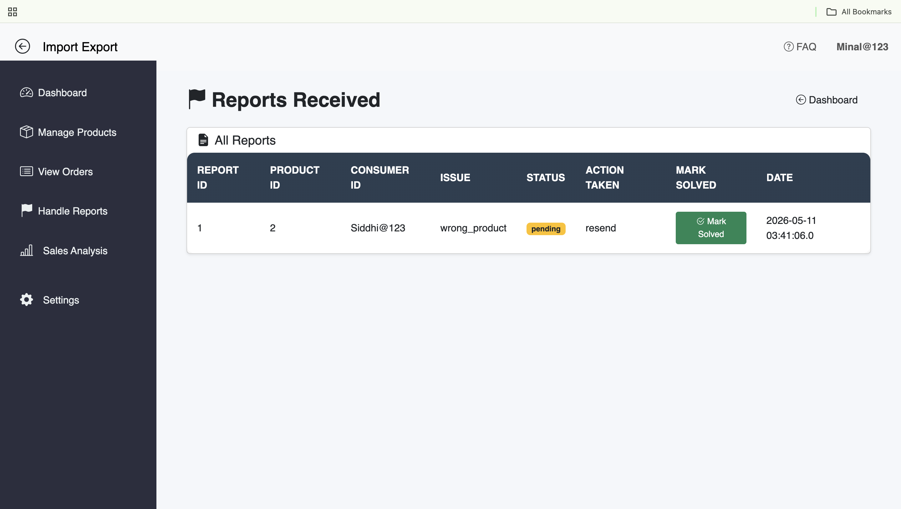

### Seller Profile

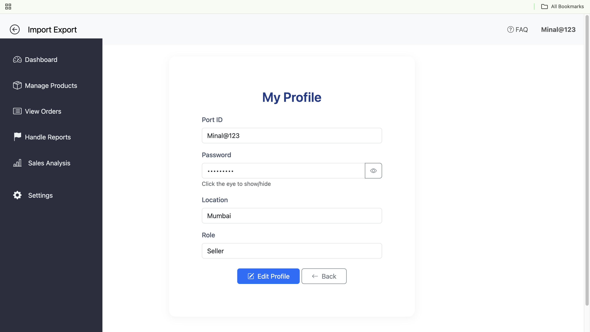

### Help & Support

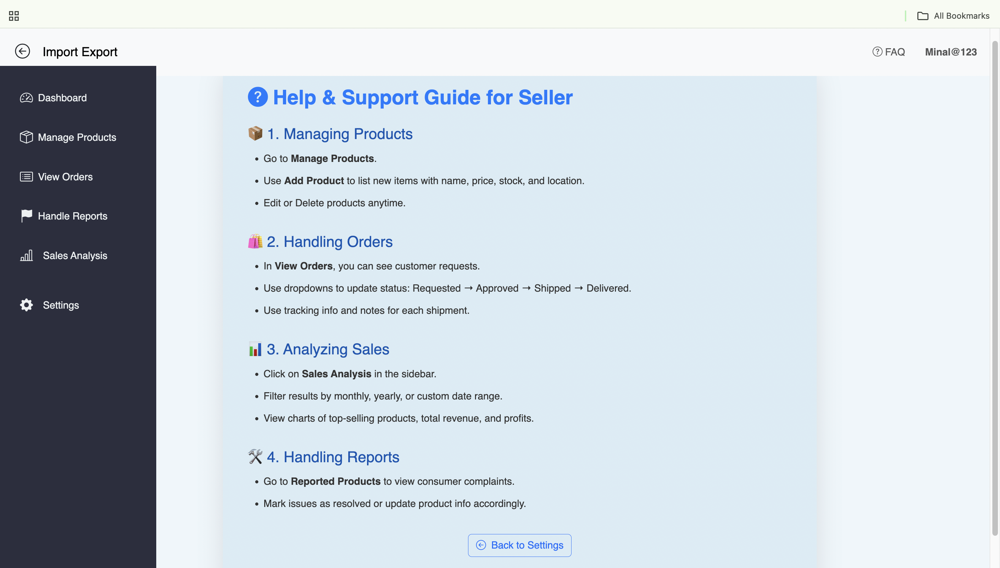

---

## **Objectives of the Project**

1. To provide a **digital platform** for trade management between sellers and consumers.
2. To **automate manual operations** such as order tracking, product listing, and reporting issues.
3. To enable **secure authentication and authorization** for multiple user roles.
4. To provide **real-time tracking** of products and order status updates.
5. To offer **data visualization and sales analysis** using charts and reports.
6. To maintain a centralized **database system** for better record management.

---

## **System Architecture (MVC)**

The project is structured according to the **Model–View–Controller (MVC)** architecture:

* **Model** → Handles data and database operations (POJOs and DAO classes).
* **View** → JSP pages for UI and presentation.
* **Controller** → Servlets that manage request flow between Model and View.

This design makes the application **modular, reusable, and scalable**.

---

##  **Modules of the System**

### **Consumer Module**

* Register and login securely.
* Browse available products listed by sellers.
* Add products to cart and place orders.
* Track placed orders with live status (Placed → Dispatched → Delivered).
* Report issues related to products.
* Manage and update profile details.
* Cancel orders before dispatch.

---

### **Seller Module**

* Seller registration and login.
* Add new products with price, description, and image.
* Edit or delete existing products.
* View and manage consumer orders.
* Update order status (Placed → Out for Delivery → Delivered).
* Respond to consumer-reported issues.
* Analyze sales data using charts and exportable reports.

---

###  **Sales Analysis Module**

* Visualizes sales data using **Chart.js**.
* Exports sales data to **CSV** for record-keeping.
* Tracks total sales, best-selling products, and revenue statistics.

---

###  **Profile Management Module**

* Allows users to update personal details and password.
* Contains pages like **Profile**, **Settings**, **About**, **Contact**, **FAQ**, and **Help** for better user experience.

---

## **Core Functionalities**

| Functionality                      | Description                                                             |
| ---------------------------------- | ----------------------------------------------------------------------- |
| **Authentication & Authorization** | Role-based login for consumers and sellers with session tracking.       |
| **Product Management**             | Sellers can add, modify, delete, and list products.                     |
| **Order Management**               | Consumers can place and cancel orders; sellers can update order status. |
| **Issue Reporting**                | Consumers can report defective or delayed products.                     |
| **Sales Analytics**                | Generate visual and downloadable reports for sales data.                |
| **Profile Handling**               | Manage user profiles, settings, and personal details.                   |

---

## **Database Design**

The backend uses **MySQL** for data storage, with tables such as:

| Table Name          | Description                                                                |
| ------------------- | -------------------------------------------------------------------------- |
| `users`             | Stores details of consumers and sellers (role, credentials, profile info). |
| `products`          | Contains product details like name, category, price, stock, and seller ID. |
| `orders`            | Records all orders placed by consumers and their status.                   |
| `cart`              | Stores temporary items before placing an order.                            |
| `reported_products` | Manages user complaints and issue status.                                  |
| `sales`             | Maintains sales data for analytics and CSV export.                         |

Database includes **stored procedures** for efficient queries and **triggers** for automatic updates.

---

## **Technologies Used**

| Layer             | Technologies                |
| ----------------- | --------------------------- |
| **Frontend**      | HTML5, CSS3, JSP, Bootstrap |
| **Backend**       | Java Servlets, JDBC         |
| **Database**      | MySQL                       |
| **Server**        | Apache Tomcat               |
| **IDE**           | Eclipse                     |
| **Visualization** | Chart.js                    |
| **Architecture**  | MVC2                        |

---

## **Workflow Summary**

1. **Authentication:**
   Users (consumers/sellers) login or register based on role.

2. **Consumer Actions:**

   * View products → Add to cart → Place order → Track status.
   * Report issues or cancel order if needed.

3. **Seller Actions:**

   * Add/manage products.
   * Process and update order status.
   * Handle reported issues.
   * View and analyze sales performance.

4. **Sales Analytics:**

   * Sales data is visualized and can be exported as CSV.

---

## **Team Contributions**

| Member                      | Responsibilities                                                                                                                       |
| --------------------------- | -------------------------------------------------------------------------------------------------------------------------------------- |
| **Minal Maurya**            | Authentication & Authorization, Consumer and Seller Dashboards, Sales Analysis, Common UI Pages (Settings, About, Contact, FAQ, Help). |
| **Arpit Ghosh**             | Product Management Module (CRUD operations, product listing).                                                                          |
| **Aadesh Pathak**           | Order Management Module (cart, order tracking, order status updates).                                                                  |
| **Saiganesh Chinthakayala** | Reported Product Handling (complaint management and issue tracking).                                                                   |
| **Anisha Kanojia**          | Profile Management and frontend assistance for user pages.                                                                             |

---

## **Steps to Run the Project**

1. **Clone or Download** the project.
2. **Import into Eclipse IDE** → `File > Import > Existing Projects into Workspace`.
3. **Setup MySQL Database:**

   * Run `ImportExportFinalDB.sql` in MySQL Workbench.
   * Update DB credentials in `GetConnection.java`.
4. **Configure Apache Tomcat** (v10 or above).
5. **Run the Project:**

   ```
   http://localhost:8080/ImportExportPortal/
   ```

---

## **Future Enhancements**

* Admin module for managing users and sellers.
* Email/SMS notification for order updates.
* Online payment integration.
* Advanced analytics dashboard with filters.
* AI-based product recommendation system.

---

##  **Conclusion**

The **Import-Export Management System** effectively bridges the gap between sellers and consumers through an organized, secure, and automated platform.
It enhances the traditional trading process by introducing **real-time order tracking, role-based operations, and intelligent analytics**, making it a scalable and modern solution for digital commerce.
